## **Udacity Project: Vehicle Detection**
---
#### README
**Vehicle Detection**
  
The goals / steps of this project are the following:  
* Perform a Histogram of Oriented Gradients (HOG) feature extraction on a labeled training set of images and train a classifier Linear SVM classifier
* Optionally, you can also apply a color transform and append binned color features, as well as histograms of color, to your HOG feature vector. 
* Note: for those first two steps don't forget to normalize your features and randomize a selection for training and testing.
* Implement a sliding-window technique and use your trained classifier to search for vehicles in images.
* Run your pipeline on a video stream (start with the test_video.mp4 and later implement on full project_video.mp4) and create a heat map of recurring detections frame by frame to reject outliers and follow detected vehicles.
* Estimate a bounding box for vehicles detected.

#### [Rubric](https://review.udacity.com/#!/rubrics/513/view) Points
Here I will consider the rubric points individually and describe how I addressed each point in my implementation.  

---
#### File Submission (Implementation in Python)

My project solution includes the following files:

* **VehicleDetection.py** - provides basic functions to be invoked in different processing stages

* **TrainClassifier.py** - extract image features, train the SVM classifier, and verfiy the classifier with the test images

* **DetectVehicleInVideo.py** - utilize the pre-trained classifier, build up a processing pipeline with the 'Class BoundingBoxes' defined, and process video frames to detect vehicles

* **./output_images/xxx.jpg** - the processed test images for demo. After the classifier is trained, `TrainClassifier.py` uses the images under `./test_images/` to verify the classifier and generates processed images in `./output_images/` as results

* **TrimVideo.py** - used to extract the video sections that are most likely to have false postives. During fine-tuning of hyper-parameters of the processing pipeline, these video sections will be focused.  
(for example, see `project_video_hard_section_XX_output.mp4` uploaded in the project root folder)

* **project_video_output.mp4**  - video for demo, as an output after ```project_video.mp4``` processed by ```DetectVehicleInVideo.py```

---
### Histogram of Oriented Gradients (HOG)
---
##### 1. Explain how (and identify where in your code) you extracted HOG features from the training images.
##### 2. Explain how you settled on your final choice of HOG parameters.  
---

The example images in the size 64x64 as derived from the GTI database and the KITTI vision benchmark suite are used to form the training dataset.
  
To begin with, all the `vehicle` and `non-vehicle` images are read, which will be used as inputs to the feature extrator later. 
```
Command console output: 
================================================
Load Data Samples :
Number of Vehicle Images: 8792
Number of Non-vehicle Images: 8968
================================================
```
Below is an example of images:  
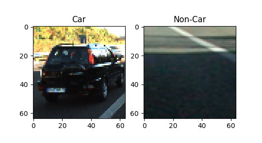  


The features extracted from each image include the histogram of oriented gradients(HOG), the histogram of color distribution, and also the vector generated from spatial binning on image pixels.

The **hyper-parameters** tuned for feature extraction with their **final decided values** are listed as below:

**Histogram of Oriented Gradients(HOG)**  
```
Hyper-Parameters:  
- color space = 'YCrCb'
- orientations = 9
- pixels per cell = 8
- cells per block = 2
- HOG Channel to process = 'ALL' (all three channels)
```
For HOG feature extraction, the library function `skimage.feature.hog()` is utilized.  
Below are the examples of HOG features: 
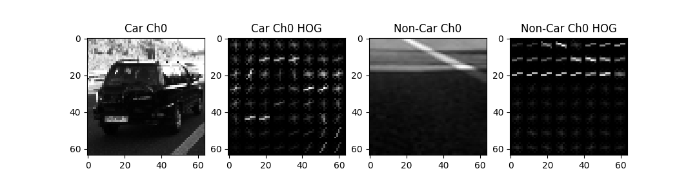  
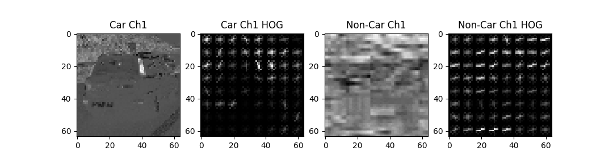  
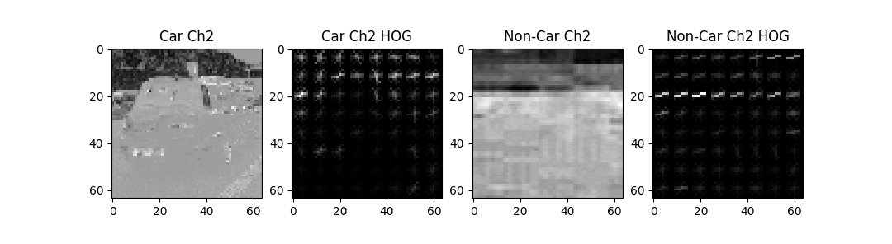  
  
**Histogram of Color**  
```
Hyper-Parameters:  
- number of histogram bins = 32
```
  
**Feature Vector from Spatial Binning on Image pixels**  
```
Hyper-Parameters:  
- spatial size = 32
```

To decide the above values of hyper-parameters, the following indicators are considered:  
- 1) Accuracy on test dataset verified with Function SVC.score() -- See section about Classifier Training 
- 2) Number of False Positive visible in the `test images` extracted from the project video -- See section about Sliding Window Search
  
  
By experiments on different parameters combination,  
the followings are observed on the above 'performance indicators of hyper-parameters ':   
  
- 1) With all HOG channels processed, Color space 'YCrCb' is able to reach 99%+ accuracy (maximum value, since it's fluctuating) on Test Dataset, while Color space 'RGB' and 'HSV" also able to score 97.5% - 98.5% accuracy, not much difference. However, in terms of the False Positives visible in the test images, 'YCrCb' overwhelms the other two, especially "RGB".
  
- 2) Changing "pixels per cell" is from 8 to 16 while other parameters same as the final ones above, the Accuracy on Test Dataset only decreased from 98.7%+(roughly, since fluctuating) to 97.8%+. However, False Positive visible in the test images increased significantly in shadow areas and some complicated sections that contain many lines and colors, especially at the time when SVC.decision_function() was not yet applied in the implementation.
  
- 3) Changing "number of histogram bins" for Color Histogram(i.e. from 32 to 16), and changing "spartial size" for Spatial Binning(i.e. 32 to 16), actually do not have obvious impact on SVC accuracy rate and the visibility of False Postive. Anyway, Number 32 is chosen since it just feels better.  
  
- 4) Changing "orientations" from 6 to 9 leads to a visible improvement in lower False Positive on the project video generally.

**Implementation Details - please refer to `Code Line 30 to 227` in `File TrainClassifier.py`,  
and `Function extract_features()` in `File VehicleDetection.py`**

---
##### 3. Describe how (and identify where in your code) you trained a classifier using your selected HOG features (and color features if you used them).  
---

With the library solution `sklearn.svm.LinearSVC` imported, a classifier using the approach of linear Support Vector Machine(SVM) is employed to identify whether an image contains a vehicle or not. 

The extracted image features(denoted as X), before being input to train the classifier, are scaled to zero-mean and unit variance using "sklearn.preprocessing.StandardScaler":
```
X_Scaler = StandardScaler().fit(X)
scaled_X = X_Scaler.transform(X)
```

Afterwards, the sample features along with the corresponding sample labels (denoted as Y) are randomized in their order, and then split randomly into a training dataset(containing 90% of sample data) and a test dataset(10% of sample data) using `train_test_split` from `sklearn`. The implementation is shown as below:
```
random_int = np.random.randint(0, 100)
X_train, X_test, y_train, y_test = train_test_split(scaled_X, y, test_size=0.10, random_state=random_int)
```

Finally, training of the classifier is performed using `Function fit()` in `sklearn.svm.LinearSVC`, and verification on the classifier results is done though `Function score() in sklearn.svm.LinearSVC`. 

```
timestamp_start = time.time()

SVC = LinearSVC()
SVC.fit(X_train, y_train)

timestamp_end = time.time()
print( "Training Time: ", round( (timestamp_end-timestamp_start), 2), "sec" )

accuracy = SVC.score(X_test, y_test)

print("Accuracy of SVC is ", round(accuracy, 4))
```

With the hyper-parameters mentioned previously (tuned for feature extraction), the achieved SVC accuracy is `99.49%`.
```
Command console output: 
================================================
SVM Training on Entire Dataset :
Feature Extraction Time:  162.55 sec
car_features shape:  (8792, 8460)
noncar_features shape:  (8968, 8460)
(car_features, noncar_features).shape ==  (2,)
X.shape ==  (17760, 8460)
scaled_X.shape ==  (17760, 8460)
y.shape ==  (17760,)
Training Time:  8.98 sec
Accuracy of SVC is  0.9949
================================================
Save SVM model with its parameters into a pickle file...
Done.
```
**Implementation Details - Please refer to `Line 187 to 275 in File TrainClassifier.py`**

---
### Sliding Window Search
---
##### 1. Describe how (and identify where in your code) you implemented a sliding window search.  How did you decide what scales to search and how much to overlap windows?
---
Five different scales of sliding windows are utilized for different searching areas, as displayed in the picture below:  
  
- Group 1: Window Size 64 x 64 (Scale: 1.0), colored in Green  
- Group 2: Window Size: 96 x 96 (Scale: 1.5), colored in Blue  
- Group 3: Window Size: 112 x 112 (Scale: 1.75), colored in Purple  
- Group 4: Window Size: 128 x 128 (Scale: 2.0), colored in Red  
- Group 5: Window Size: 160 x 160 (Scale: 2.5), colored in Yellow  
  
- Overlapping: 25% (i.e. 16 pixels for 64 window size)
  
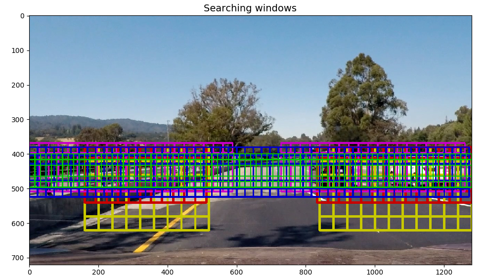

**Decision on Window Scales & Searching Areas**  
Using multiple size of searching windows is based on the consideration of these conditions: 
- 1) Vehicles at different distances to the front-view camera are shown in different size in the image
- 2) A vehicle should occupy 70% - 90% of the region of a window used for searching

Besides, considering that a vechicle should not appear in a certain size in some areas, thus different searching areas may be applied for different window scales. This can also contribute to the redution of false positives since a vehicle in a proper size is not possible to be there.

By experiments, finally it is decided to apply the above five scales of windows with their searching areas, which leads to a relatively good result of vehicle detection on the project video.

**Decision on Overlapping**  
This is a trade-off: Increasing overlapping rate may generate more reliable results when an object reaches the edge or corner of a searching window, but more searching windows need to be processed, which slows down processing speed. 25% overlapping is just right enough.

**Implementation Details - please refer to : **  
- `Code Line 446 to 609 in File TrainClassifier.py`, 
- `Function find_cars()` in `File VehicleDetection.py`  
- `Process_video_frame()` in `File DetectVehicleInVideo.py`  

---
#### 2. Show some examples of test images to demonstrate how your pipeline is working.  What did you do to optimize the performance of your classifier?
---

The processing results on the test images are output to Path `./output_images/`  
The file names under the above folder follows the naming convention below: 
 - `image_demo_[sequence_No.]_0.jpg` - final processed test image 
 - `image_demo_[sequence_No.]_1.jpg` - heatmap and all the original detected boxes  
 - `image_demo_[sequence_No.]_2.jpg` - heatmap and the combined boxes processed by `scipy.ndimage.measurements.label()`
  
```
-------------------------
Outputs in command console: 
-------------------------
Verify SVM classifier on actual images - now apply multiple sliding window scales:
Image 01: 1.02 sec to process 529 windows >> detected 62 hot windows
Image 02: 0.99 sec to process 529 windows >> detected 0 hot windows
Image 03: 0.97 sec to process 529 windows >> detected 3 hot windows
Image 04: 0.96 sec to process 529 windows >> detected 46 hot windows
Image 05: 0.99 sec to process 529 windows >> detected 51 hot windows
Image 06: 0.96 sec to process 529 windows >> detected 52 hot windows
```
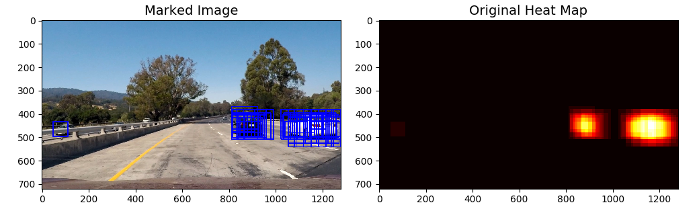
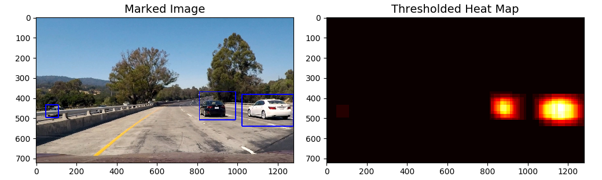
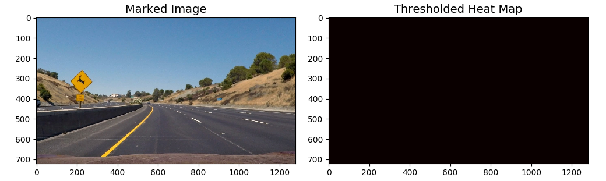
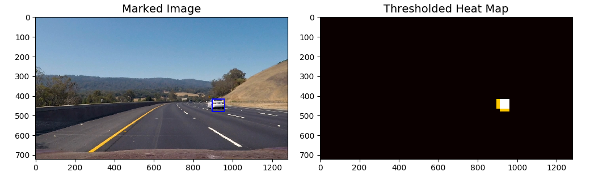
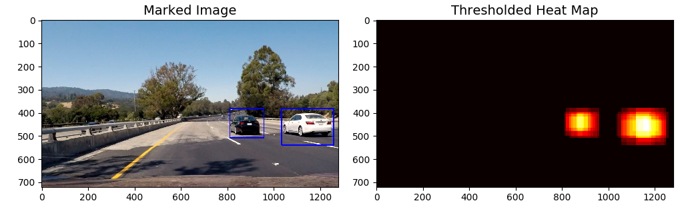
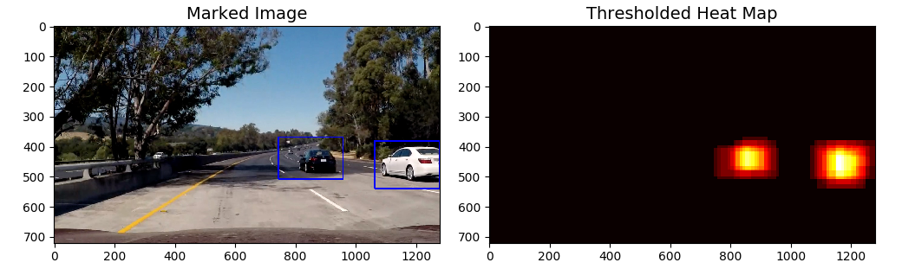
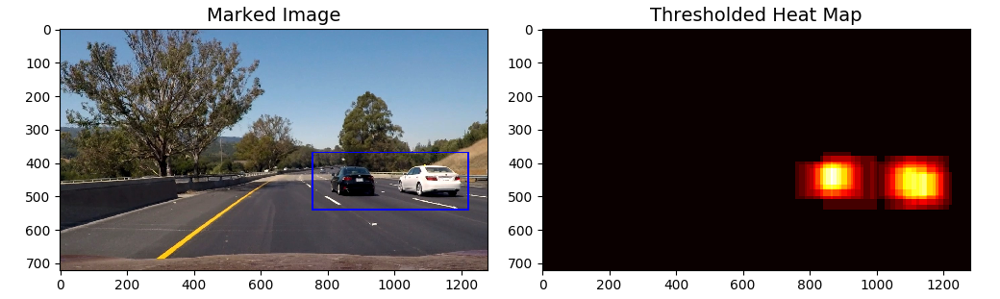
.  

**Threshold on Prediction Confidence - decision_function() from sklearn.svm.LinearSVC**

In order to reduce possibility of false positives, the distance of the samples to the separating hyperplane is considered, in addition to the prediction result of sample label. The sample distance is used as an evaluation indicator of prediction confidence.

This is implemented by applying `decision_function()` given by `sklearn.svm.LinearSVC`, with two extra hyper-parameters introduced:
```
Hyper-Parameters to Tune:  
    ConfidenceThreshold_BigWindow = 0.65
    ConfidenceThreshold_SmallWindow = 0.55
```
```
    test_prediction = svc.predict(test_features)
    predict_confidence  = svc.decision_function(test_features)

    # (scale <= 1.75) refers to Window Size 64, 96, 112
    # (scale > 1.75) refers to Window Size 128, 160
    if  test_prediction == 1:
        if(   ( (scale <= 1.75) and (abs(predict_confidence) > ConfidenceThreshold_SmallWindow) ) 
           or ( (scale >  1.75) and (abs(predict_confidence) > ConfidenceThreshold_BigWindow)   ) ):
            # Prediction result is True - sliding window contains a vehicle
            # Take action to mark the vehicle in the image 
```
As shown in the code above, different window size can take different threshold of "prediction confidence"  
.  
**Implementation Details - please refer to `Code Line 446 to 609 in File TrainClassifier.py`,  
and `Function find_cars()` in `File VehicleDetection.py`**  
  
---
### Video Implementation  
  
#### 1. Provide a link to your final video output.  Your pipeline should perform reasonably well on the entire project video (somewhat wobbly or unstable bounding boxes are ok as long as you are identifying the vehicles most of the time with minimal false positives.)
  
Here's the link to the demo video for vehicle detection: 
[](project_video_output.mp4)

---
#### 2. Describe how (and identify where in your code) you implemented some kind of filter for false positives and some method for combining overlapping bounding boxes.  
---

**[1] Algorithm to Filter False Positives based on Heatmap Temperature Accumulation**  
1) Integrate a heat map over the last 32 frames of video - by summing up seperate heatmaps from the last 32 frames (if frame count is less than 32, then sum up all the available frames), such that areas of multiple detections get "hot", while transient false positives stay "cool".  

2) Threshold the sum-up of heatmaps to remove false positives - Apply a threshold which equals to the number of the current accumulated heapmaps (i.e. using 32 in the current implementation). For those pixels with heatmap value lower than the threshold, they will be set to 0 and get filtered out.  

3) Combine the overlapping or adjacent sections in the thresholded heatmap using the library function `scipy.ndimage.measurements.label()`, such that multiple detections close to each other will be merged into one detection of vehicle.  

4) Draw retangles which are able to conver all the combined detected regions onto the original video frame  

Hyper-Parameters tuned for heatmap filtering is introduced:  
```
Hyper-Parameters to Tune:  
  
- `BoundingBoxes.num_prev_records = 32`: Number of frames of which the heat maps will be integrated into one: Variable   
- `HeatValidRatio in BoundingBoxes = 0.8`: (Heatmap Threshold) affecting the count of detections in the integrated heatmap considered as a valid detection  
```
**For implementation Details, please refer to:**  
-- `Process_video_frame()` in `File DetectVehicleInVideo.py`  
-- `BoundingBoxes.add_boxes()`, `get_all_boxes()` & `get_bboxes_threshold()` in `File DetectVehicleInVideo.py`  
.  
  
**[2] Additional Mask to Further Filter Out False Positives**  
  
In addition to the approach described in Section[1], extra filter is applied to achieve better results in removing false positives.  

The basic idea is: "How many single frames among the past 32 frames has the vehicle been detected ?"  

1) If a pixel is detected twice in a single frame, then this pixel is considered as a "good" detection  

2) In the past 32 frames, how many "good" detections are there for this pixel  

3) If over the last 32 frames, there are more than 22 frames of "good detection" for this pixel, then the pixel detection is considered "valid", otherwise being filtered out to be zero.  
  
This extra filter is used **because** such a pattern is noticed:  
Sometimes False positives either do not come at all in a single frame, or suddently burst into a single frame a lot. This situation can not be filtered by Approach[1] efficiently.
  
**For implementation Details, please refer to:**  
-- `BoundingBoxes.add_heatmap()`, `get_all_heatmap()` & `get_framecount_threshold()` in `File DetectVehicleInVideo.py`  
.  
**[3] The final result of detection will be: (Result of [1]) And (Result of [2])**  
  
---

### Discussion

##### 1. Potential Issues and Limitation of the Pipeline
1) The vehicle detection pipeline may not always generate reliable results at shadow areas in high contrast, areas with trees, and the edge of road with a fence in high contrast. These false positives are the biggest problem when doing the project.  
  
With the tatics mentioned in the report and fine-tuning of hyper-parameters, false positives are reduced, but still cannot be eliminated.
  
2) The vehicle detection pipeline sometimes detects vehicles at the other side of the road(opposite direction lane), but the results may not be precise and may affect accuracy of the false positive filtering with accumulated heatmaps.
  
3) Processing speed is low, only around 1 frame per second.
  
##### 2. Possible Improvements to the Pipeline  
1) Reduce total number of searching windows on each image to speed up the processing   
2) Augment the datasets with more diverse labeled data (or maybe also negative mining) to improve the SVM classifier for less false positive detections  
3) Continue to fine-tune the threhold hyper-parameters introduced in this implementation for better results  
4) Update the pipeline with new tatics or new approaches to achieve better performance  
  